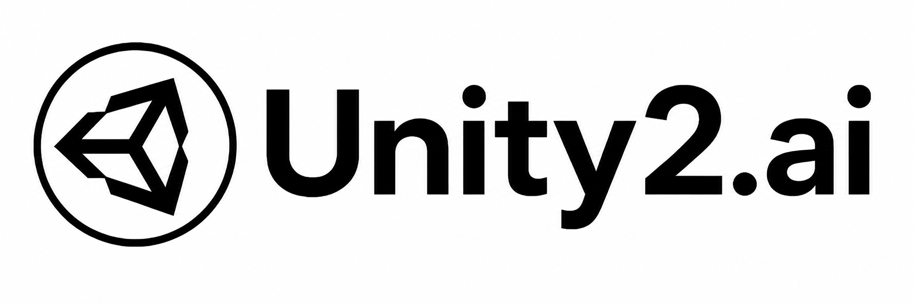
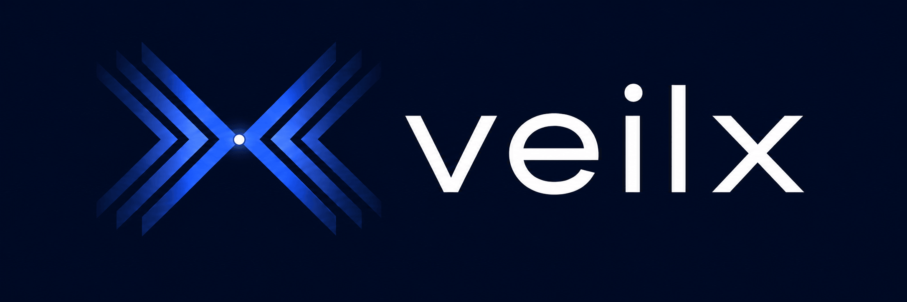

# Sub2API

<div align="center">

[](https://golang.org/)
[](https://vuejs.org/)
[](https://www.postgresql.org/)
[](https://redis.io/)
[](https://www.docker.com/)

<a href="https://trendshift.io/repositories/21823" target="_blank"></a>

**サブスクリプションクォータ配分のための AI API ゲートウェイプラットフォーム**

[English](README.md) | [中文](README_CN.md) | 日本語

</div>

> **Sub2API が公式に使用しているドメインは `sub2api.org` と `pincc.ai` のみです。Sub2API の名称を使用している他のウェブサイトは、サードパーティによるデプロイやサービスであり、本プロジェクトとは一切関係がありません。ご利用の際はご自身で確認・判断をお願いします。**

---

## デモ

Sub2API をオンラインでお試しください: **[https://demo.sub2api.org/](https://demo.sub2api.org/)**

デモ用認証情報（共有デモ環境です。セルフホスト環境では**自動作成されません**）:

| メールアドレス | パスワード |
|-------|----------|
| admin@sub2api.org | admin123 |

## 概要

Sub2API は、AI 製品のサブスクリプションから API クォータを配分・管理するために設計された AI API ゲートウェイプラットフォームです。ユーザーはプラットフォームが生成した API キーを通じて上流の AI サービスにアクセスでき、プラットフォームは認証、課金、負荷分散、リクエスト転送を処理します。

## 機能

- **マルチアカウント管理** - 複数の上流アカウントタイプ（OAuth、APIキー）をサポート
- **APIキー配布** - ユーザー向けの APIキーの生成と管理
- **精密な課金** - トークンレベルの使用量追跡とコスト計算
- **スマートスケジューリング** - スティッキーセッション付きのインテリジェントなアカウント選択
- **同時実行制御** - ユーザーごと・アカウントごとの同時実行数制限
- **レート制限** - 設定可能なリクエスト数およびトークンレート制限
- **内蔵決済システム** - EasyPay、Alipay、WeChat Pay、Stripe に対応。ユーザーのセルフサービスチャージが可能で、別途決済サービスのデプロイは不要（[設定ガイド](docs/PAYMENT.md)）
- **管理ダッシュボード** - 監視・管理のための Web インターフェース
- **外部システム連携** - 外部システム（チケット管理など）を iframe 経由で管理ダッシュボードに埋め込み可能

## ❤️ スポンサー

> [こちらに掲載しませんか？](mailto:support@pincc.ai)

<table>
<tr>
<td width="180" align="center" valign="middle"><a href="https://shop.pincc.ai/"></a></td>
<td valign="middle"><b><a href="https://shop.pincc.ai/">PinCC</a></b> は Sub2API 上に構築された公式リレーサービスで、Claude Code、Codex、Gemini などの人気モデルへの安定したアクセスを提供します。デプロイやメンテナンスは不要で、すぐにご利用いただけます。</td>
</tr>
<tr>
<td width="180"><a href="https://www.packyapi.com/register?aff=sub2api"></a></td>
<td>PackyCode のご支援に感謝します！PackyCode は Claude Code、Codex、Gemini などのリレーサービスを提供する信頼性の高い API 中継プラットフォームです。本ソフト利用者向けに特別割引があります：<a href="https://www.packyapi.com/register?aff=sub2api">このリンク</a>で登録し、チャージ時に「sub2api」クーポンを入力すると 10% オフになります。</td>
</tr>

<tr>
<td width="180"><a href="https://ctok.ai"></a></td>
<td>CTok.ai のご支援に感謝します！CTok.ai はワンストップ AI プログラミングツールサービスプラットフォームの構築に取り組んでいます。Claude Code の専用プランと技術コミュニティサービスを提供し、Google Gemini や OpenAI Codex もサポートしています。丁寧に設計されたプランと専門的な技術コミュニティを通じて、開発者に安定したサービス保証と継続的な技術サポートを提供し、AI アシスト プログラミングを真の生産性向上ツールにします。<a href="https://ctok.ai">こちら</a>から登録！</td>
</tr>

<tr>
<td width="180"><a href="https://aigocode.com/invite/SUB2API"></a></td>
<td>AIGoCode のご支援に感謝します！AIGoCode は Claude Code、Codex、最新の Gemini モデルを統合したオールインワンプラットフォームで、安定的かつ効率的でコストパフォーマンスに優れた AI コーディングサービスを提供します。柔軟なサブスクリプションプラン、アカウント停止リスクゼロ、VPN 不要の直接アクセス、超高速レスポンスが特長です。AIGoCode は sub2api ユーザー向けに特別特典を用意しています：<a href="https://aigocode.com/invite/SUB2API">こちらのリンク</a>から登録すると、初回チャージ時に 10% のボーナスクレジットを追加プレゼント！</td>
</tr>

<tr>
<td width="180"><a href="https://apikey.fun/register?aff=SUB2API"></a></td>
<td>APIKEY.FUN のご支援に感謝します！<a href="https://apikey.fun/register?aff=SUB2API">APIKEY.FUN</a> は sub2api オープンソースプロジェクトのコアコントリビューターの一つであり、オープンで安定した、コストパフォーマンスに優れた AI API アクセスサービスの提供に取り組んでいます。プラットフォームは Claude、OpenAI、Gemini など人気モデルの API 中継サービスをサポートし、価格は公式料金のわずか 7% から。専用リンク <a href="https://apikey.fun/register?aff=SUB2API">APIKEY</a> から登録すると、すべてのチャージで永久 5% 割引をご利用いただけます。</td>
</tr>

<tr>
<td width="180"><a href="https://code.silkapi.com/register?aff=SUB2API"></a></td>
<td>SilkAPI のご支援に感謝します！<a href="https://code.silkapi.com/register?aff=SUB2API">SilkAPI</a> は Sub2API をベースに構築された中継サービスで、高速かつ安定した Codex API 中継の提供に特化しています。</td>
</tr>

<tr>
<td width="180"><a href="https://ylscode.com/"></a></td>
<td>YLS Code のご支援に感謝します！<a href="https://ylscode.com/">YLS Code</a> は安全なエンタープライズグレードの Coding Agent 生産性サービスの構築に取り組んでおり、安定かつ高速な Codex / Claude / Gemini サブスクリプションサービスと従量課金 API の柔軟なプランを提供しています。期間限定で新規登録者に 3 日間の Codex 試用特典をプレゼント中！</td>
</tr>

<tr>
<td width="180"><a href="https://www.aicodemirror.com/register?invitecode=KMVZQM"></a></td>
<td>AICodeMirror のご支援に感謝します！AICodeMirror は Claude Code / Codex / Gemini CLI の公式高安定性リレーサービスを提供しており、エンタープライズグレードの同時実行、迅速な請求書発行、24時間年中無休の専属テクニカルサポートを備えています。Claude Code / Codex / Gemini の公式チャネルを定価の 38% / 2% / 9% で利用可能、チャージ時にはさらに追加割引！AICodeMirror は sub2api ユーザー向けに特別特典を提供中：<a href="https://www.aicodemirror.com/register?invitecode=KMVZQM">こちらのリンク</a>から登録すると、初回チャージが 20% オフ、法人のお客様は最大 25% オフ！</td>
</tr>

<tr>
<td width="180"><a href="https://shop.bmoplus.com/?utm_source=github"></a></td>
<td>本プロジェクトにご支援いただいた BmoPlus に感謝いたします！BmoPlusは、AIサブスクリプションのヘビーユーザー向けに特化した信頼性の高いAIアカウントサービスプロバイダーであり、安定した ChatGPT Plus / ChatGPT Pro (完全保証) / Claude Pro / Super Grok / Gemini Pro の公式代行チャージおよび即納アカウントを提供しています。こちらの<a href="https://shop.bmoplus.com/?utm_source=github">BmoPlus AIアカウント専門店/代行チャージ</a>経由でご登録・ご注文いただいたユーザー様は、GPTを 公式サイト価格の約1割（90% OFF） という驚異的な価格でご利用いただけます！</td>
</tr>

<tr>
<td width="180"><a href="https://bestproxy.com/?keyword=a2e8iuol"></a></td>
<td>Bestproxy のご支援に感謝します！<a href="https://bestproxy.com/?keyword=a2e8iuol">Bestproxy</a> は高純度の住宅IPを提供し、1アカウント1IP専有をサポートしています。実際の家庭ネットワークとフィンガープリント分離を組み合わせることで、リンク環境の分離を実現し、関連付けによるリスク管理の確率を低減します。</td>
</tr>

<tr>
<td width="180"><a href="https://pateway.ai/?ch=1tsfr51"></a></td>
<td>PatewayAI のご支援に感謝します！PatewayAI は、ヘビーAI開発者向けに公式直結を重視した高品質モデルAPIリレーサービスプロバイダーです。Claude 全シリーズおよび Codex シリーズモデルを提供し、100%公式ソースから直接供給 — 偽りなし、水増しなし、検証歓迎。課金は完全透明で、トークン単位の請求書を1件ずつ監査可能です。
エンタープライズ級の高同時接続にも対応し、法人顧客向けに専用管理プラットフォームを提供しています。法人顧客は正式な契約を締結し、請求書の発行が可能です。詳細は公式サイトでお問い合わせください。
<a href="https://pateway.ai/?ch=1tsfr51">こちらのリンク</a>から登録すると、$3 のトライアルクレジットがもらえます。チャージは最大40%オフ、友達紹介で双方にボーナス付与 — 紹介報酬は最大 $150。</td>
</tr>

<tr>
<td width="180"><a href="https://api.pptoken.org/register?promo=SUB2API"></a></td>
<td>PPToken.org のご支援に感謝します！<a href="https://api.pptoken.org/register?promo=SUB2API">PPToken.org</a> は GPT シリーズモデルの API 中継サービスを専門としており、Codex、Claude Code、OpenAI 互換クライアント、Gemini CLI などのツール接続をサポートしています。チャージは 1:1（1元＝1ドル分のクレジット）、GPT モデルは最低 0.16 倍のレート倍率で、総合コストは公式価格の約 2.2% 、最速ファーストトークンは約1秒 — 開発者が低コスト・高速レスポンスで GPT モデル機能にアクセスするのに最適です。テクニカルサポート：24時間365日リアルな人間が対応（ボットではありません）、グループ内で @技術 すれば 10 分以内に返信。スポンサー特典：先着 200 名のユーザーが<a href="https://api.pptoken.org/register?promo=SUB2API">専用登録リンク</a>から登録し、プロモコード `SUB2API` を入力すると、Codex / Claude Code の無料トライアルクレジットを獲得できます — 最低利用額なし、カード登録不要。
</td>
</tr>

<tr>
<td width="180"><a href="https://runapi.co/register?aff=fu2E"></a></td>
<td>RunAPI のご支援に感謝します！<a href="https://runapi.co/register?aff=fu2E">RunAPI</a> は効率的で安定した API プラットフォームで、OpenRouter の代替として利用できます。1つの API キーで OpenAI、Claude、Gemini、DeepSeek、Grok など 150以上の主要モデルにアクセスでき、価格は最低 10% から。非常に安定しており、Claude Code や OpenClaw などのツールとシームレスに互換します。
</td>
</tr>

<tr>
<td width="180"><a href="https://unity2.ai/register?source=sub2api"></a></td>
<td>Unity2 のご支援に感謝します！<a href="https://unity2.ai/register?source=sub2api">Unity2</a> は個人開発者、チーム、企業向けの高性能 AI モデル API 中継プラットフォームです。中国の大手企業に長期にわたりサービスを提供しており、1日あたり 300 億以上のトークン呼び出しを処理し、5000 RPM 級の高並列性をサポートします。1つの API キーで Claude Code、Codex、OpenAI モデル、IDE プラグイン、Agent ワークフローなど様々なシナリオに対応できます。エンタープライズグレードの安定供給能力を備え、高並列・継続的な呼び出し・チームの集中購入シーンでも低レイテンシと高可用性を維持します。残高課金、組み合わせサブスクリプション、初回チャージ特典、企業向け請求書発行、専属 1v1 サポートにも対応しており、個人の頻繁な利用にも企業の長期導入にも適しています。今 Unity2.ai に登録すると $2 の残高、公式グループに参加するとさらに $10 の残高がもらえ、合計最大 $12 の無料クレジットを獲得できます — 試用後に長期利用したい方に最適です。<a href="https://unity2.ai/register?source=sub2api">登録リンク</a>
</td>
</tr>

<tr>
<td width="180"><a href="https://veilx.io/#/hello/SJRBRVDV"></a></td>
<td>Veilx のご支援に感謝します！<a href="https://veilx.io/#/hello/SJRBRVDV">Veilx</a> CDN は超大規模 API リクエストシナリオ向けに設計されており、AI 中継サービスと AI API 呼び出しチェーンに対して深く最適化されています。高並列・高頻度リクエスト・大容量トラフィックに容易に対応し、開発者と企業により高速で安定した、低レイテンシの加速体験を提供します。OpenAI、Claude、Gemini などの AI インターフェース中継はもちろん、チャット、画像生成、Embedding、ストリーミング出力などの複雑なシナリオでも、Veilx は応答速度と接続安定性を大幅に向上させ、ネットワーク変動によるタイムアウトや失敗を効果的に削減します。さらに、Veilx は中国三大ネットワーク最適化の高速回線を提供しており、中国本土から海外 AI サービスへのアクセス速度と安定性を大幅に向上させます。グローバル AI 中継プラットフォーム、海外 AI SaaS、越境ビジネス、高並列 API システム展開に特に適しています。AI API のために生まれ、あなたの AI 中継サービスをより速く、より安定して、より安心に。<a href="https://veilx.io/#/hello/SJRBRVDV">購入リンク</a>
</td>
</tr>

</table>

## エコシステム

Sub2API を拡張・統合するコミュニティプロジェクト:

| プロジェクト | 説明 | 機能 |
|---------|-------------|----------|
| ~~[Sub2ApiPay](https://github.com/touwaeriol/sub2apipay)~~ | ~~セルフサービス決済システム~~ | **内蔵済み** — 決済機能は Sub2API に統合されました。別途デプロイは不要です。[決済設定ガイド](docs/PAYMENT.md)をご参照ください |
| [sub2api-mobile](https://github.com/ckken/sub2api-mobile) | モバイル管理コンソール | ユーザー管理、アカウント管理、監視ダッシュボード、マルチバックエンド切り替えが可能なクロスプラットフォームアプリ（iOS/Android/Web）。Expo + React Native で構築 |

## 技術スタック

| コンポーネント | 技術 |
|-----------|------------|
| バックエンド | Go 1.25.7, Gin, Ent |
| フロントエンド | Vue 3.4+, Vite 5+, TailwindCSS |
| データベース | PostgreSQL 15+ |
| キャッシュ/キュー | Redis 7+ |

---

## Nginx リバースプロキシに関する注意

Sub2API（または CRS）を Nginx でリバースプロキシし、Codex CLI と組み合わせて使用する場合、Nginx の `http` ブロックに以下の設定を追加してください:

```nginx
underscores_in_headers on;
```

Nginx はデフォルトでアンダースコアを含むヘッダー（例: `session_id`）を破棄するため、マルチアカウント構成でのスティッキーセッションルーティングに支障をきたします。

---

## デプロイ

### 方法1: スクリプトによるインストール（推奨）

GitHub Releases からビルド済みバイナリをダウンロードするワンクリックインストールスクリプトです。

#### 前提条件

- Linux サーバー（amd64 または arm64）
- PostgreSQL 15+（インストール済みかつ稼働中）
- Redis 7+（インストール済みかつ稼働中）
- root 権限

#### インストール手順

```bash
curl -sSL https://raw.githubusercontent.com/Wei-Shaw/sub2api/main/deploy/install.sh | sudo bash
```

スクリプトは以下を実行します:
1. システムアーキテクチャの検出
2. 最新リリースのダウンロード
3. バイナリを `/opt/sub2api` にインストール
4. systemd サービスの作成
5. システムユーザーと権限の設定

#### インストール後の作業

```bash
# 1. サービスを起動
sudo systemctl start sub2api

# 2. 起動時の自動起動を有効化
sudo systemctl enable sub2api

# 3. ブラウザでセットアップウィザードを開く
# http://YOUR_SERVER_IP:8080
```

セットアップウィザードでは以下の設定を行います:
- データベース設定
- Redis 設定
- 管理者アカウントの作成

#### アップグレード

**管理ダッシュボード**の左上にある**アップデートを確認**ボタンをクリックすることで、ダッシュボードから直接アップグレードできます。

Web インターフェースでは以下が可能です:
- 新しいバージョンの自動確認
- ワンクリックでのアップデートのダウンロードと適用
- 必要に応じたロールバック

#### よく使うコマンド

```bash
# ステータスを確認
sudo systemctl status sub2api

# ログを表示
sudo journalctl -u sub2api -f

# サービスを再起動
sudo systemctl restart sub2api

# アンインストール
curl -sSL https://raw.githubusercontent.com/Wei-Shaw/sub2api/main/deploy/install.sh | sudo bash -s -- uninstall -y
```

---

### 方法2: Docker Compose（推奨）

PostgreSQL と Redis のコンテナを含む Docker Compose でデプロイします。

#### 前提条件

- Docker 20.10+
- Docker Compose v2+

#### クイックスタート（ワンクリックデプロイ）

自動デプロイスクリプトを使用して簡単にセットアップできます:

```bash
# デプロイ用ディレクトリを作成
mkdir -p sub2api-deploy && cd sub2api-deploy

# デプロイ準備スクリプトをダウンロードして実行
curl -sSL https://raw.githubusercontent.com/Wei-Shaw/sub2api/main/deploy/docker-deploy.sh | bash

# サービスを起動
docker compose up -d

# ログを表示
docker compose logs -f sub2api
```

**スクリプトの動作内容:**
- `docker-compose.local.yml`（`docker-compose.yml` として保存）と `.env.example` をダウンロード
- セキュアな認証情報（JWT_SECRET、TOTP_ENCRYPTION_KEY、POSTGRES_PASSWORD）を自動生成
- 自動生成されたシークレットで `.env` ファイルを作成
- データディレクトリを作成（バックアップ・移行が容易なローカルディレクトリを使用）
- 生成された認証情報を参照用に表示

#### 手動デプロイ

手動でセットアップする場合:

```bash
# 1. リポジトリをクローン
git clone https://github.com/Wei-Shaw/sub2api.git
cd sub2api/deploy

# 2. 環境設定ファイルをコピー
cp .env.example .env

# 3. 設定を編集（セキュアなパスワードを生成）
nano .env
```

**`.env` の必須設定:**

```bash
# PostgreSQL パスワード（必須）
POSTGRES_PASSWORD=your_secure_password_here

# JWT シークレット（推奨 - 再起動後もユーザーのログイン状態を保持）
JWT_SECRET=your_jwt_secret_here

# TOTP 暗号化キー（推奨 - 再起動後も二要素認証を維持）
TOTP_ENCRYPTION_KEY=your_totp_key_here

# オプション: 管理者アカウント
ADMIN_EMAIL=admin@example.com
ADMIN_PASSWORD=your_admin_password

# オプション: カスタムポート
SERVER_PORT=8080
```

**セキュアなシークレットの生成方法:**
```bash
# JWT_SECRET を生成
openssl rand -hex 32

# TOTP_ENCRYPTION_KEY を生成
openssl rand -hex 32

# POSTGRES_PASSWORD を生成
openssl rand -hex 32
```

```bash
# 4. データディレクトリを作成（ローカルバージョンの場合）
mkdir -p data postgres_data redis_data

# 5. すべてのサービスを起動
# オプション A: ローカルディレクトリバージョン（推奨 - 移行が容易）
docker compose -f docker-compose.local.yml up -d

# オプション B: 名前付きボリュームバージョン（シンプルなセットアップ）
docker compose up -d

# 6. ステータスを確認
docker compose -f docker-compose.local.yml ps

# 7. ログを表示
docker compose -f docker-compose.local.yml logs -f sub2api
```

#### デプロイバージョン

| バージョン | データストレージ | 移行 | 推奨用途 |
|---------|-------------|-----------|----------|
| **docker-compose.local.yml** | ローカルディレクトリ | ✅ 容易（ディレクトリ全体を tar） | 本番環境、頻繁なバックアップ |
| **docker-compose.yml** | 名前付きボリューム | ⚠️ docker コマンドが必要 | シンプルなセットアップ |

**推奨:** データ管理が容易な `docker-compose.local.yml`（スクリプトによるデプロイ）を使用してください。

#### アクセス

ブラウザで `http://YOUR_SERVER_IP:8080` を開いてください。

管理者パスワードが自動生成された場合は、ログで確認できます:
```bash
docker compose -f docker-compose.local.yml logs sub2api | grep "admin password"
```

#### アップグレード

```bash
# 最新イメージをプルしてコンテナを再作成
docker compose -f docker-compose.local.yml pull
docker compose -f docker-compose.local.yml up -d
```

#### 簡単な移行（ローカルディレクトリバージョン）

`docker-compose.local.yml` を使用している場合、新しいサーバーへの移行が簡単です:

```bash
# 移行元サーバーにて
docker compose -f docker-compose.local.yml down
cd ..
tar czf sub2api-complete.tar.gz sub2api-deploy/

# 新しいサーバーに転送
scp sub2api-complete.tar.gz user@new-server:/path/

# 移行先サーバーにて
tar xzf sub2api-complete.tar.gz
cd sub2api-deploy/
docker compose -f docker-compose.local.yml up -d
```

#### よく使うコマンド

```bash
# すべてのサービスを停止
docker compose -f docker-compose.local.yml down

# 再起動
docker compose -f docker-compose.local.yml restart

# すべてのログを表示
docker compose -f docker-compose.local.yml logs -f

# すべてのデータを削除（注意！）
docker compose -f docker-compose.local.yml down
rm -rf data/ postgres_data/ redis_data/
```

---

### 方法3: ソースからビルド

開発やカスタマイズのためにソースコードからビルドして実行します。

#### 前提条件

- Go 1.21+
- Node.js 18+
- PostgreSQL 15+
- Redis 7+

#### ビルド手順

```bash
# 1. リポジトリをクローン
git clone https://github.com/Wei-Shaw/sub2api.git
cd sub2api

# 2. pnpm をインストール（未インストールの場合）
npm install -g pnpm

# 3. フロントエンドをビルド
cd frontend
pnpm install
pnpm run build
# 出力先: ../backend/internal/web/dist/

# 4. フロントエンドを組み込んだバックエンドをビルド
cd ../backend
go build -tags embed -o sub2api ./cmd/server

# 5. 設定ファイルを作成
cp ../deploy/config.example.yaml ./config.yaml

# 6. 設定を編集
nano config.yaml
```

> **注意:** `-tags embed` フラグはフロントエンドをバイナリに組み込みます。このフラグがない場合、バイナリはフロントエンド UI を提供しません。

**`config.yaml` の主要設定:**

```yaml
server:
  host: "0.0.0.0"
  port: 8080
  mode: "release"

database:
  host: "localhost"
  port: 5432
  user: "postgres"
  password: "your_password"
  dbname: "sub2api"

redis:
  host: "localhost"
  port: 6379
  password: ""

jwt:
  secret: "change-this-to-a-secure-random-string"
  expire_hour: 24

default:
  user_concurrency: 5
  user_balance: 0
  api_key_prefix: "sk-"
  rate_multiplier: 1.0
```

### Sora ステータス（一時的に利用不可）

> ⚠️ Sora 関連の機能は、上流統合およびメディア配信の技術的問題により一時的に利用できません。
> 現時点では本番環境で Sora に依存しないでください。
> 既存の `gateway.sora_*` 設定キーは予約されていますが、これらの問題が解決されるまで有効にならない場合があります。

`config.yaml` では追加のセキュリティ関連オプションも利用できます:

- `cors.allowed_origins` - CORS 許可リスト
- `security.url_allowlist` - 上流/価格/CRS ホストの許可リスト
- `security.url_allowlist.enabled` - URL バリデーションの無効化（注意して使用）
- `security.url_allowlist.allow_insecure_http` - バリデーション無効時に HTTP URL を許可
- `security.url_allowlist.allow_private_hosts` - プライベート/ローカル IP アドレスを許可
- `security.response_headers.enabled` - 設定可能なレスポンスヘッダーフィルタリングを有効化（無効時はデフォルトの許可リストを使用）
- `security.csp` - Content-Security-Policy ヘッダーの制御
- `billing.circuit_breaker` - 課金エラー時にフェイルクローズ
- `server.trusted_proxies` - X-Forwarded-For パースの有効化
- `turnstile.required` - リリースモードでの Turnstile 必須化

**⚠️ セキュリティ警告: HTTP URL 設定**

`security.url_allowlist.enabled=false` の場合、システムはデフォルトで最小限の URL バリデーションを行い、**HTTP URL を拒否**して HTTPS のみを許可します。HTTP URL を許可するには（開発環境や内部テスト用など）、以下を明示的に設定する必要があります:

```yaml
security:
  url_allowlist:
    enabled: false                # 許可リストチェックを無効化
    allow_insecure_http: true     # HTTP URL を許可（⚠️ セキュリティリスクあり）
```

**または環境変数で設定:**

```bash
SECURITY_URL_ALLOWLIST_ENABLED=false
SECURITY_URL_ALLOWLIST_ALLOW_INSECURE_HTTP=true
```

**HTTP を許可するリスク:**
- API キーとデータが**平文**で送信される（傍受の危険性）
- **中間者攻撃（MITM）**を受けやすい
- **本番環境には不適切**

**HTTP を使用すべき場面:**
- ✅ ローカルサーバーでの開発・テスト（http://localhost）
- ✅ 信頼できるエンドポイントを持つ内部ネットワーク
- ✅ HTTPS 取得前のアカウント接続テスト
- ❌ 本番環境（HTTPS のみを使用）

**この設定なしで表示されるエラー例:**
```
Invalid base URL: invalid url scheme: http
```

URL バリデーションまたはレスポンスヘッダーフィルタリングを無効にする場合は、ネットワーク層を強化してください:
- 上流ドメイン/IP のエグレス許可リストを適用
- プライベート/ループバック/リンクローカル範囲をブロック
- TLS のみのアウトバウンドトラフィックを強制
- プロキシで機密性の高い上流レスポンスヘッダーを除去

```bash
# 6. アプリケーションを実行
./sub2api
```

#### 開発モード

```bash
# バックエンド（ホットリロード付き）
cd backend
go run ./cmd/server

# フロントエンド（ホットリロード付き）
cd frontend
pnpm run dev
```

#### コード生成

`backend/ent/schema` を編集した場合、Ent + Wire を再生成してください:

```bash
cd backend
go generate ./ent
go generate ./cmd/server
```

---

## シンプルモード

シンプルモードは、フル SaaS 機能を必要とせず、素早くアクセスしたい個人開発者や社内チーム向けに設計されています。

- 有効化: 環境変数 `RUN_MODE=simple` を設定
- 違い: SaaS 関連機能を非表示にし、課金プロセスをスキップ
- セキュリティに関する注意: 本番環境では `SIMPLE_MODE_CONFIRM=true` も設定する必要があります

---

## Antigravity サポート

Sub2API は [Antigravity](https://antigravity.so/) アカウントをサポートしています。認証後、Claude および Gemini モデル用の専用エンドポイントが利用可能になります。

### 専用エンドポイント

| エンドポイント | モデル |
|----------|-------|
| `/antigravity/v1/messages` | Claude モデル |
| `/antigravity/v1beta/` | Gemini モデル |

### Claude Code の設定

```bash
export ANTHROPIC_BASE_URL="http://localhost:8080/antigravity"
export ANTHROPIC_AUTH_TOKEN="sk-xxx"
```

### ハイブリッドスケジューリングモード

Antigravity アカウントはオプションの**ハイブリッドスケジューリング**をサポートしています。有効にすると、汎用エンドポイント `/v1/messages` および `/v1beta/` も Antigravity アカウントにリクエストをルーティングします。

> **⚠️ 警告**: Anthropic Claude と Antigravity Claude は**同じ会話コンテキスト内で混在させることはできません**。グループを使用して適切に分離してください。

### 既知の問題

Claude Code では、Plan Mode を自動的に終了できません。（通常、ネイティブの Claude API を使用する場合、計画が完了すると Claude Code はユーザーに計画を承認または拒否するオプションをポップアップ表示します。）

**回避策**: `Shift + Tab` を押して手動で Plan Mode を終了し、計画を承認または拒否するためのレスポンスを入力してください。

---

## プロジェクト構成

```
sub2api/
├── backend/                  # Go バックエンドサービス
│   ├── cmd/server/           # アプリケーションエントリ
│   ├── internal/             # 内部モジュール
│   │   ├── config/           # 設定
│   │   ├── model/            # データモデル
│   │   ├── service/          # ビジネスロジック
│   │   ├── handler/          # HTTP ハンドラー
│   │   └── gateway/          # API ゲートウェイコア
│   └── resources/            # 静的リソース
│
├── frontend/                 # Vue 3 フロントエンド
│   └── src/
│       ├── api/              # API 呼び出し
│       ├── stores/           # 状態管理
│       ├── views/            # ページコンポーネント
│       └── components/       # 再利用可能なコンポーネント
│
└── deploy/                   # デプロイファイル
    ├── docker-compose.yml    # Docker Compose 設定
    ├── .env.example          # Docker Compose 用環境変数
    ├── config.example.yaml   # バイナリデプロイ用フル設定ファイル
    └── install.sh            # ワンクリックインストールスクリプト
```

## 免責事項

> **本プロジェクトをご利用の前に、以下をよくお読みください:**
>
> :rotating_light: **利用規約違反のリスク**: 本プロジェクトの使用は Anthropic の利用規約に違反する可能性があります。使用前に Anthropic のユーザー契約をよくお読みください。本プロジェクトの使用に起因するすべてのリスクは、ユーザー自身が負うものとします。
>
> :book: **免責事項**: 本プロジェクトは技術的な学習および研究目的のみで提供されています。作者は、本プロジェクトの使用によるアカウント停止、サービス中断、その他の損失について一切の責任を負いません。

---

## スター履歴

<a href="https://star-history.com/#Wei-Shaw/sub2api&Date">
 <picture>
   <source media="(prefers-color-scheme: dark)" srcset="https://api.star-history.com/svg?repos=Wei-Shaw/sub2api&type=Date&theme=dark" />
   <source media="(prefers-color-scheme: light)" srcset="https://api.star-history.com/svg?repos=Wei-Shaw/sub2api&type=Date" />
   
 </picture>
</a>

---

## ライセンス

本プロジェクトは [GNU Lesser General Public License v3.0](LICENSE)（またはそれ以降のバージョン）の下でライセンスされています。

Copyright (c) 2026 Wesley Liddick

---

<div align="center">

**このプロジェクトが役に立ったら、ぜひスターをお願いします！**

</div>
